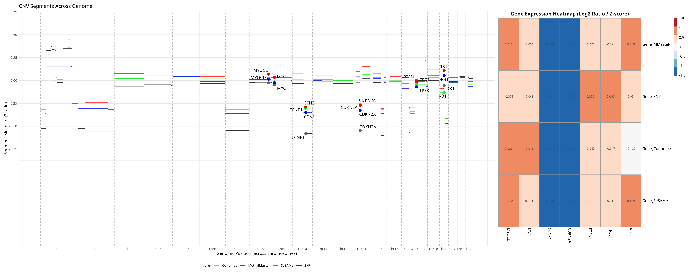

# Code Paper for Benchmarking Project

```{r setup, include=FALSE}
# Bioconductor first
library(GenomeInfoDb)
library(AnnotationDbi)
library(AnnotationHub)
library(org.Hs.eg.db)
library(TxDb.Hsapiens.UCSC.hg19.knownGene)
library(rentrez)
library(GenomicRanges)
library(GenomicFeatures)
library(pheatmap)

# Then tidyverse and dplyr last so they win all masking conflicts
library(tidyverse)
library(dplyr)
library(ggplot2)
library(ggrepel)
library(patchwork)
library(cowplot)
library(gridGraphics)
library(gridExtra)
library(ggplotify)
library(readxl)
library(RColorBrewer)
library(reshape2)

conflictRules("dplyr", mask.ok = c("filter", "select", "summarize", 
                                    "summarise", "mutate", "arrange",
                                    "rename", "count", "group_by"))

filter    <- dplyr::filter
select    <- dplyr::select
summarize <- dplyr::summarize
mutate    <- dplyr::mutate
arrange   <- dplyr::arrange
rename    <- dplyr::rename

knitr::opts_chunk$set(warning = FALSE, message = FALSE)
knitr::opts_chunk$set(tidy.opts = list(width.cutoff = 60), tidy = TRUE)
```

Hi! This is a very informally written document just to give the beats of what is happening in the code, and the analysis I am doing. It needs to be MUCH more formalized before being shown publicly, but it is useful for understanding!

## Preprocessing

All data is in disparate forms. So, I standardized it so that it can be easily utilized in the downstream without having to continuously redo work. I chose to standardize the notation to the Conumee notations, using

-   chrom for chromosomes.

-   loc.start for when the location of a segment starts.

-   loc.end for when the location of a segment ends.

-   seg.mean for the log2-ratio.

-   CNVStatus for whether a block represents a deletion, amplification & normal segments.

-   type is a representative factor to say what method gave that segment, because we compose a database for each case, and we need to distinguish the segments from each other.

-   we also add an extra factor named "Gene" to label relevant segments which have a gene inside it.

Attached are the pre-processing blocks.

#### LMS Processing

```{r}
labLMSProc <- function(STTq, Technology, binSize){
  
  
  # Correlate by STT information between methylation Sentrix and SNP data.
  correlationSheet <- read.csv("~/Work/Analysis/LabData/LMS_SNP_EPIC_array_data/correlative.csv") %>% filter(STT == STTq)
  
  cnvMatch <- read_delim(paste0("~/Work/Analysis/LabData/LMS_SNP_EPIC_array_data/ChAS/ChAS_data_01Feb2026/ChAS_LMS_Probe_and_segment_level_data_01Feb2026/STT", 
                              STTq, "_Recentered_Segment_level_data_01Feb2026.segment.txt"))
  
  # methylMatch <- read.csv(paste0("~/Work/Analysis/Outputs/MethylMaster/LabLMS/", 
  #paste0(correlationSheet$Sentrix_ID[1],"_", 
  #     correlationSheet$Sentrix_Position[1], "/"), 
  # "autocorrected_regions.csv"))
  
  conumeeMatch <- read.csv(paste0("~/Work/Analysis/Outputs/Conumee/LabLMS/", binSize,"/", paste0(correlationSheet$Sentrix_ID[1],"_", 
                                                                                                 correlationSheet$Sentrix_Position[1],".csv")))
  
  sesameMatch <- read.csv(paste0("~/Work/Analysis/Outputs/SeSAMe/LabLMS/", binSize,"/", paste0("segments_",correlationSheet$Sentrix_ID[1],"_", 
                                                                                               correlationSheet$Sentrix_Position[1],".csv")))
  
  methylMatch <- read.csv(paste0("~/Work/Analysis/Outputs/MethylMaster/LabLMS/", binSize,"/", 
                                 correlationSheet$Sentrix_ID[1],"_", correlationSheet$Sentrix_Position[1],"/autocorrected_regions.csv"))
  
  cnvMatch <- cnvMatch %>% dplyr::filter(!(Type == "LOH")) %>% dplyr::filter(Chromosome != 24 & Chromosome != 25) %>% dplyr::select("Chromosome", "StartPosition", "StopPosition", "Median Log2 Ratio") %>% 
    dplyr::rename(chrom = "Chromosome", loc.start = "StartPosition", loc.end = "StopPosition", seg.mean = "Median Log2 Ratio") %>%
    dplyr::mutate(seg.mean = as.numeric(seg.mean)) %>%
    dplyr::mutate(CNVStatus = case_when(
      seg.mean <= -0.2 ~ "Deletion", 
      seg.mean >= 0.2 ~ "Amplification", 
      TRUE ~ "Normal"
    ), type = "SNP")
  

  if(Technology == "MethylMaster") {
    methylMatch <- methylMatch %>% dplyr::rename(
      seg.mean = "Mean", loc.start = "bp.Start", 
      loc.end = "bp.End") %>% dplyr::select(
        seg.mean, loc.start, loc.end, Chromosome) %>% mutate(
          type = "MethylMaster") %>% dplyr::rename(chrom = "Chromosome") %>% 
      dplyr::mutate(chrom = as.numeric(gsub("chr", "", chrom))) %>% filter(!is.na(chrom)) %>%
      dplyr::mutate(loc.start = as.numeric(loc.start), loc.end = as.numeric(loc.end), seg.mean = as.numeric(seg.mean)) %>% mutate(CNVStatus = case_when(
        seg.mean <= -0.2 ~ "Deletion", 
        seg.mean >= 0.2 ~ "Amplification", 
        TRUE ~ "Normal"
      ))
    combinedSet <- rbind(methylMatch, cnvMatch) %>% mutate(Gene = as.character(0)) %>% arrange(chrom)
  }
  
  if(Technology == "Conumee"){
    conumeeMatch <- conumeeMatch %>% dplyr::select(chrom, loc.start, loc.end, seg.mean) %>% mutate(CNVStatus = case_when(
      seg.mean <= -0.2 ~ "Deletion", 
      seg.mean >= 0.2 ~ "Amplification", 
      TRUE ~ "Normal"
    )) %>% mutate(chrom = as.numeric(gsub("chr", "", chrom))) %>% mutate(type = "Conumee")
    combinedSet <- rbind(conumeeMatch, cnvMatch) %>% mutate(Gene = as.character(0)) %>% arrange(chrom)
  }
  
  if(Technology == "Sesame"){
    sesameMatch <- sesameMatch %>% dplyr::select(c("chrom", "loc.start", 
                                                   "loc.end", "seg.mean")) %>% dplyr::mutate(
                                                     chrom = str_remove_all(chrom, "chr")) %>% filter(
                                                       !(chrom == "X") & !(chrom == "Y")) %>% mutate(
                                                         chrom = as.numeric(chrom)) %>% arrange(chrom) %>% mutate(
                                                           CNVStatus = case_when(seg.mean > 0.3 ~ "Amplification",
                                                                                 seg.mean < -0.3 ~ "Deletion",
                                                                                 TRUE ~ "Normal"), type = "SeSAMe") 
    combinedSet <- rbind(sesameMatch, cnvMatch) %>% mutate(Gene = as.character(0), seg.mean = as.numeric(seg.mean)) %>% arrange(chrom)
  }
  combinedSet
}
```

It utilizes an unique identifier (STT) to retrieve relevant datasets from inside the files and processes them into the correct format. It then returns the whole dataset.

#### LM Processing

```{r}
LMStt <- function(STT, bin, tech){
  
  corrSheet <- read.csv("~/Work/Analysis/LabData/LM_SNP_EPIC_array_data/EPIC_array_data_LM/idat_files/SampSheet.csv") %>%
    dplyr::filter(STT == STT)
  sentrixID <- corrSheet$Sentrix_ID[1]
  sentrixPos <- corrSheet$Sentrix_Position[1]
  
  SNP <- read_delim(paste0("~/Work/Analysis/LabData/LM_SNP_EPIC_array_data/ChAS/ChAS_data_01Feb2026/ChAS_LM_Probe_and_segment_level_data_01Feb2026/STT",
                 STT,"_Segment_level_data_01Feb2026.segment.txt"))
  SNP <- SNP %>% dplyr::filter(!(Type == "LOH")) %>% dplyr::filter(Chromosome != 24 & Chromosome != 25) %>% dplyr::select("Chromosome", "StartPosition", "StopPosition", "Median Log2 Ratio") %>% 
    dplyr::rename(chrom = "Chromosome", loc.start = "StartPosition", loc.end = "StopPosition", seg.mean = "Median Log2 Ratio") %>%
    dplyr::mutate(seg.mean = as.numeric(seg.mean)) %>%
    dplyr::mutate(CNVStatus = case_when(
      seg.mean <= -0.2 ~ "Deletion", 
      seg.mean >= 0.2 ~ "Amplification", 
      TRUE ~ "Normal"
    ), type = "SNP")
  
  
  # MethylMasteR
  cnvMethyl <- NULL;
  if(tech == "MethylMaster"){
    outputDirMethyl <- paste0("~/Work/Analysis/Outputs/MethylMaster/LM/",bin,"/",sentrixID,"_",sentrixPos,"/autocorrected_regions.csv")
    cnvMethyl <- read.csv(outputDirMethyl) %>%
      dplyr::select(c("Chromosome", "bp.Start", "bp.End", "Mean")) %>% dplyr::rename(
        chrom = "Chromosome",
        loc.start = "bp.Start",
        loc.end = "bp.End",
        seg.mean = "Mean"
      ) %>% dplyr::mutate(
        CNVStatus = case_when(seg.mean > 0.3 ~ "Amplification",
                              seg.mean < -0.3 ~ "Deletion",
                              TRUE ~ "Normal"), type = "MethylMaster"
      )
    cnvMethyl$chrom <- as.numeric(str_remove_all(cnvMethyl$chrom, pattern = "chr"))
    cnvMethyl <- cnvMethyl %>% filter(!(is.na(chrom))) %>% arrange(chrom)
  }
  
  
  # SeSAMe
  sesameOutput <- NULL
  if(tech == "Sesame"){
    outputDirSesame <- paste0("~/Work/Analysis/Outputs/SeSAMe/LM/bins/",bin,"/","segments_",sentrixID, "_", sentrixPos, ".csv")
    sesameOutput <- read.csv(outputDirSesame) %>% dplyr::select(c("chrom", "loc.start", 
                                                                  "loc.end", "seg.mean")) %>% dplyr::mutate(
                                                                    chrom = str_remove_all(chrom, "chr")) %>% filter(
                                                                      !(chrom == "X") & !(chrom == "Y")) %>% mutate(
                                                                        chrom = as.numeric(chrom)) %>% arrange(chrom) %>% mutate(
                                                                          CNVStatus = case_when(seg.mean > 0.3 ~ "Amplification",
                                                                                                seg.mean < -0.3 ~ "Deletion",
                                                                                                TRUE ~ "Normal"), type = "SeSAMe") 
  }
  
  
  # Conumee
  case <- NULL
  if(tech == "Conumee"){
    outputDirConumee <- paste0("~/Work/Analysis/Outputs/Conumee/LMData/bins/",bin,"/",sentrixID,"_",sentrixPos,".csv")
    case <- read.csv(outputDirConumee)
    case <- case %>% dplyr::select(-c("ID", "bstat")) %>% 
      mutate(CNVStatus = case_when(case$seg.mean > 0.2 ~ "Amplification",
                                   case$seg.mean < -0.2 ~ "Deletion",
                                   TRUE ~ "Normal"), 
             chrom = as.numeric(str_remove_all(chrom, "chr"))) %>% 
      dplyr::arrange(chrom) %>% mutate(type = "Conumee") %>%
      dplyr::select(-c("num.mark", "pval", "seg.median", "X"))
  }
  
  output <- rbind(SNP,case,sesameOutput,cnvMethyl)
  output$chrom <- as.character(output$chrom)
  output
}
```

This does basically the same thing, except for leiomyoma samples instead of leiomyosarcoma samples. It then returns the relevant dataset. The Gene factor is dropped because it is not evaluated for Leiomyoma.

#### Normal Processing

```{r}
labNmrlProc <- function(Sentrix, Technology, binSize){
  # Correlate by STT information between methylation Sentrix and SNP data.
  correlationSheet <- read.csv(
    "~/Work/Analysis/LabData/Normal_smooth_muscle_EPIC_data/idat_files/Sample_Sheet_Normal.csv") %>% filter(Basename == Sentrix)
  
  conumeeMatch <- read.csv(paste0("~/Work/Analysis/Outputs/Conumee/LabNormals/", binSize,"/", paste0(Sentrix,".csv")))
  
  sesameMatch <- read.csv(paste0("~/Work/Analysis/Outputs/SeSAMe/Normals/", binSize,"/", paste0("segments_",Sentrix,".csv")))
  
  if(Technology == "MethylMaster") {
    methylMatch <- methylMatch %>% dplyr::rename(
      seg.mean = "Mean", loc.start = "bp.Start", 
      loc.end = "bp.End") %>% dplyr::select(
        seg.mean, loc.start, loc.end, Chromosome) %>% mutate(
          type = "MethylMaster") %>% dplyr::rename(chrom = "Chromosome") %>% 
      dplyr::mutate(chrom = as.numeric(gsub("chr", "", chrom))) %>% filter(!is.na(chrom)) %>%
      dplyr::mutate(loc.start = as.numeric(loc.start), loc.end = as.numeric(loc.end), seg.mean = as.numeric(seg.mean)) %>% mutate(CNVStatus = case_when(
        seg.mean <= -0.2 ~ "Deletion", 
        seg.mean >= 0.2 ~ "Amplification", 
        TRUE ~ "Normal"
      ))
    combinedSet <- methylMatch %>% arrange(chrom)
  }
  
  if(Technology == "Conumee"){
    conumeeMatch <- conumeeMatch %>% dplyr::select(chrom, loc.start, loc.end, seg.mean) %>% mutate(CNVStatus = case_when(
      seg.mean <= -0.2 ~ "Deletion", 
      seg.mean >= 0.2 ~ "Amplification", 
      TRUE ~ "Normal"
    )) %>% mutate(chrom = as.numeric(gsub("chr", "", chrom))) %>% mutate(type = "Conumee")
    combinedSet <- conumeeMatch %>% arrange(chrom)
  }
  
  if(Technology == "Sesame"){
    sesameMatch <- sesameMatch %>% dplyr::select(c("chrom", "loc.start", 
                                                   "loc.end", "seg.mean")) %>% dplyr::mutate(
                                                     chrom = str_remove_all(chrom, "chr")) %>% filter(
                                                       !(chrom == "X") & !(chrom == "Y")) %>% mutate(
                                                         chrom = as.numeric(chrom)) %>% arrange(chrom) %>% mutate(
                                                           CNVStatus = case_when(seg.mean > 0.3 ~ "Amplification",
                                                                                 seg.mean < -0.3 ~ "Deletion",
                                                                                 TRUE ~ "Normal"), type = "SeSAMe") 
    combinedSet <- sesameMatch %>% arrange(chrom)
  }
  
  
  
  combinedSet
}
```

This is the final processing function to process out the normals, contributing to the genome-wide log2-ratio.

## Analysis

**We now move onto the actual meat of the analytic code. This will be split into statistics generation & visualization.**

### Basic Metrics

#### Bin size vs. accuracy – normal tissue 

This was done to evaluate whether the tissues that were being used for normalization were actually normal. The code has been annotated with comments below to gain full understanding of the system.

This entire evaluation is contained in a function, which asks for a set of IDs (essentially the IDs of the normals, and the bin that we want to evaluate the statistics for.

```{r}
  
 caseCorr <- function(IDs, bin){
  
  Methyl <- c()
  Ses <- c()
  Con <- c()
  
  for(ID in IDs){
    MethylMaster <- read.csv(paste0("~/Outputs/MethylMaster/Normals/",bin,"/",ID,"/autocorrected_regions.csv"))
    MethylMaster <- median(MethylMaster$Mean)
    Sesame <- read.csv(paste0("~/Outputs/SeSAMe/Normals/",bin,"/segments_",ID,".csv"))
    Sesame <- median(Sesame$seg.mean)
    Conumee <- read.csv(paste0("~/Outputs/Conumee/LabNormals/",bin,"/",ID,".csv"))
    Conumee <- median(Conumee$seg.mean)
    
    Methyl <- c(Methyl, MethylMaster)
    Ses <- c(Ses, Sesame)
    Con <- c(Con,Conumee)
    
  }
  
  acc <- data.frame(Conumee_Median = median(Con), 
                    Conumee_SD = sd(Con), 
                    Sesame_Median = median(Ses), 
                    Sesame_SD = sd(Ses), 
                    Methyl_Median = median(Methyl), 
                    Methyl_SD = sd(Methyl))
  acc
  
}

```

It then takes the median log2 ratio of each sample for each software and bin, and returns it as a list, given by the initialized Methyl (MethylMasteR), Ses (SeSAMe) and Con (Conumee) values.

It then returns a data frame for easy post-processing.

To add it to the word document, I just read it off the terminal, but I could also create a dataframe for this purpose quite quickly. The driver code just involves querying the samples across the 3 bin sizes being studied.

#### Genomic Index for LMS

```{r}
GenomicIndex <- function(dfCH3, sw){
  if(sw == F){
    dfSNP <- dfCH3 %>% dplyr::filter(type == "SNP") %>%
      dplyr::filter(CNVStatus != "Normal")
    modChrom <- length(unique(dfSNP$chrom))
    CNVCount <- nrow(dfSNP)
    ret <- (CNVCount^2)/modChrom
    return(ret)
  } else {
  
  # Filter out for clinically significant segments %>% filter(CNVStatus != Normal)
  dfCH3f <- dfCH3 %>% dplyr::filter(type == "Conumee" | type == "MethylMaster" | type == "SeSAMe") %>%
    dplyr::filter(CNVStatus != "Normal")
  # Count
  CNVCount <- nrow(dfCH3f)
  modChrom <- length(unique(dfCH3f$chrom))
  
  
  # Return value
  ret <- (CNVCount^2)/modChrom
  return(ret) 
  }
}
```

This code takes a single dataframe from one of the technologies (as given by the preprocessor above for the LMS), filters it out only for that technology, filters for whether it reflects an CNV, and the counts how many there are, then takes the formula:

$$
GI = \frac{CNV^2}{22}
$$

As given. It just then returns that value.

"sw" as an argument in the function is because I wanted to use the function for both SNPs and the methylation CNVs, so it is a convenient way to work with both types without using more if-statements.

#### Genome Modified

This is a pretty basic metric which works very similarly to the GI calculation above.

```{r}
GenomeModified <- function(dfCH3){
  df <- dfCH3 %>% dplyr::filter(type != "SNP", CNVStatus != "Normal") %>%
    dplyr::mutate(width = loc.end - loc.start) 
  modifiedWidth <- sum(df$width)
  hg19_info <- getChromInfoFromUCSC("hg19") %>% dplyr::filter(assembled == "TRUE")
  hg19_info <- hg19_info[1:22,]
  hg19_total <- sum(hg19_info$size)
  
  return((modifiedWidth/hg19_total) * 100)
  
}
```

It simply queries the information for hg19, filters it to the 22 chromosomes we are studying, sums the whole length, and divided it by the length of modified segments we actually have, and returns a percentage.

The driver code is quite important here however. It calculates the genome changed for each case, then adds it to an array. We can guarantee the order pair because the loop happens in the same order as the dataframe of the SNP data and how the cases are ordered in there.

Then, it prints out by taking a Pearson's correlation on the different arrays, and in place, makes dataframes containing the percentage of genome changed, so that it can be manually inspected.

```{r}
stts <- c(9202, 9203, 9327, 9328, 9337, 9338, 9350, 9353, 9354, 9355, 9356, 9357, 9358)
bins <- c(10000, 50000, 1e+05, 1e+06)
tech <- c("MethylMaster", "Conumee", "Sesame")
genomeCalc <- read_excel("~/Work/Analysis/LabData/LMS_SNP_EPIC_array_data/ChAS/ChAS_data_01Feb2026/design_13LMS_CNVs_other_info_01Feb2026.xlsx") %>%
  dplyr::select("STT", "% Genome Changed") %>% dplyr::rename(gc = "% Genome Changed")
bin10kb <- genomeCalc
binDef <- genomeCalc
bin100kb <- genomeCalc
bin1Mb <- genomeCalc

for(bin in bins){
  print(bin)
  valM <- c()
  valS <- c()
  valC <- c()
  for(stt in stts){
    valM <- c(valM, GenomeModified(labLMSProc(STTq = stt, Technology = "MethylMaster", binSize = bin)))
    valS <- c(valS, GenomeModified(labLMSProc(STTq = stt, Technology = "Sesame", binSize = bin)))
    valC <- c(valC, GenomeModified(labLMSProc(STTq = stt, Technology = "Conumee", binSize = bin)))
  }
  if(bin == 10000){
    bin10kb <- data.frame(STT = bin10kb$STT, gc = bin10kb$gc, 
                          pcentmodM = valM,
                          pcentmodS = valS,
                          pcentmodC = valC)
  }
  if(bin == 50000){
    binDef <- data.frame(STT = binDef$STT, gc = binDef$gc, 
                          pcentmodM = valM,
                          pcentmodS = valS,
                          pcentmodC = valC)
  }
  if(bin == 1e+05){
    bin100kb <- data.frame(STT = bin100kb$STT, gc = bin100kb$gc, 
                          pcentmodM = valM,
                          pcentmodS = valS,
                          pcentmodC = valC)
  }
  if(bin == 1e+06){
    bin1Mb <- data.frame(STT = bin1Mb$STT, gc = bin1Mb$gc, 
                          pcentmodM = valM,
                          pcentmodS = valS,
                          pcentmodC = valC)
  }
  
  
  print(paste0("MethylMasteR: ",cor(genomeCalc$gc, valM)))
  print(paste0("SeSAMe: ",cor(genomeCalc$gc, valS)))
  print(paste0("Conumee: ",cor(genomeCalc$gc, valC)))
  
}
```

### Advanced Metrics

#### Accuracy Across Bins

```{r}
fpCheck <- function(df) {
  library(GenomicRanges)
  library(dplyr)
  df <- df %>% dplyr::select(-c("Gene")) # Removes genes, it's unnecessary for this purpose
  
  pred_df <- df %>% filter(!(type == "SNP")) # The methylation dataset
  pred_df$chrom <- as.character(pred_df$chrom)
  truth_df <- df %>% filter(type == "SNP") # The SNP dataset
  truth_df$chrom <- as.character(truth_df$chrom)
  
  # Both chromosomes are made into characters because we want to use them as factors
  # ---- Step 1: hg19 chromosome sizes (numeric chromosomes 1 to 22) ----
  hg19_info <- getChromInfoFromUCSC("hg19") %>% dplyr::filter(assembled == "TRUE") # Just gets the main dataset from UCSC.
  hg19_info <- hg19_info[1:22,] # Only uses the first 22 chromosomes.
  hg19_chr_sizes <- data.frame(
    Chromosome = as.character(1:22),
    Genome_bp = hg19_info$size
  ) # Makes them into a referenceable dataframe.
  
  # ---- Step 2: Convert to GRanges ---- Does what it says on the tin
  truth_gr <- GRanges(seqnames = truth_df$chrom,
                      ranges = IRanges(start = truth_df$loc.start, end = truth_df$loc.end),
                      CNV = truth_df$CNVStatus)
  
  pred_gr <- GRanges(seqnames = pred_df$chrom,
                     ranges = IRanges(start = pred_df$loc.start, end = pred_df$loc.end),
                     CNV = pred_df$CNVStatus)
  
  # ---- Step 3: Overlaps and TP ----
  hits <- findOverlaps(pred_gr, truth_gr) # Finds the overlaps between the two GRanges
  
  overlap_ranges <- pintersect(pred_gr[queryHits(hits)], truth_gr[subjectHits(hits)])
  pred_cnv <- mcols(pred_gr)$CNV[queryHits(hits)] # Returns whether the intersections are deletions, amplifications or normals
  truth_cnv <- mcols(truth_gr)$CNV[subjectHits(hits)] # Returns whether the intersections are deletions, amplifications or normals
  
  # The returns are for the corresponding datasets.
  
  tp_df <- data.frame(
    Chromosome = as.character(seqnames(overlap_ranges)),
    width = width(overlap_ranges),
    pred_cnv = pred_cnv,
    truth_cnv = truth_cnv
  ) # Creates a dataframe from the given data
  tp_df <- tp_df %>%
    filter(pred_cnv == truth_cnv) %>%
    group_by(Chromosome) %>%
    summarise(TP_bp = sum(width), .groups = "drop")
  
  # ---- Step 4: False Positives ----
  fp_df <- data.frame(
    Chromosome = as.character(seqnames(overlap_ranges)),
    width = width(overlap_ranges),
    pred_cnv = pred_cnv,
    truth_cnv = truth_cnv
  ) %>% filter(pred_cnv != truth_cnv, truth_cnv == "Normal") %>%
    group_by(Chromosome) %>%
    summarise(FP_bp = sum(width), .groups = "drop") # Calculates the false positives
  
  # ---- Step 5: False Negatives ----
  fn_df <- data.frame(
    Chromosome = as.character(seqnames(overlap_ranges)),
    width = width(overlap_ranges),
    pred_cnv = pred_cnv,
    truth_cnv = truth_cnv
  ) %>% filter(pred_cnv != truth_cnv, pred_cnv == "Normal") %>%
    group_by(Chromosome) %>%
    summarise(FN_bp = sum(width), .groups = "drop") # Calculates the false negatives
 
  # ---- Step 6: Merge and compute accuracy ----
  final_eval <- hg19_chr_sizes %>%
    left_join(tp_df, by = "Chromosome") %>%
    left_join(fp_df, by = "Chromosome") %>%
    left_join(fn_df, by = "Chromosome") %>%
    mutate(across(c(TP_bp, FP_bp, FN_bp), ~replace_na(., 0))) %>%
    mutate(
      CNV_bp = TP_bp + FP_bp + FN_bp,
      TN_bp = Genome_bp - CNV_bp,
      Accuracy = (TP_bp + TN_bp) / Genome_bp,
      CNV_Only_Accuracy = ifelse((TP_bp + FP_bp + FN_bp) == 0, NA,
                                 TP_bp / (TP_bp + FP_bp + FN_bp))
    ) %>%
    arrange(as.numeric(Chromosome)) # Joins all the analysis together, so it can be seen at once, and then calculates the accuracy across each case
  
  accuracy <- sum(final_eval$Accuracy) / 22
  
  return(list(final_eval, accuracy))
}
```

This takes the processed dataframes from above, and checks against all possibilities, true negatives, true positives, and their false counterparts. It has been commented appropriately for understanding, as they all interact with each other.

#### **Gene level analysis**

There are a lot of moving parts to this visualization. This is done step by step. The below function annotates the dataframe from org.Hs.eg.db (a database of Homo Sapiens genomes), using Entrez genes. This will then enable a post processing step to generate the graphs which I showed earlier.

This happens by:

-   Annotating the genes initially with the Entrez gene database

-   It then puts both of them into GRanges to intersect the two to make sure that we don't call segments that aren't a part of the genes we are studying

-   It then annotates the segments with their relevant genes.

-   It can happen that sometimes genes are split across two software-generated segments or SNP segments. In these cases, we take the average of the segments.

```{r}
NoGraphGeneGen <- function(Gene, db = NULL, case){ # Updated function.
  
  
  # This section annotates the processed dataframe with genes by
  # Querying Entrez to get the genes we want to, get their locations
  # Overlap those locations onto the existing dataframe, and voila
  # We know where the genes are!
  entrez_idsDB <- mapIds(org.Hs.eg.db, 
                         keys=Gene, 
                         column="ENTREZID", 
                         keytype="SYMBOL",
                         multiVals="first")
  chr_locations <- AnnotationDbi::select(org.Hs.eg.db,
                                         keys = entrez_idsDB,
                                         columns = c("CHR", "CHRLOC", "CHRLOCEND"),
                                         keytype = "ENTREZID")
  txdb <- TxDb.Hsapiens.UCSC.hg19.knownGene
  gene_ranges <- genes(txdb)
  target_genes_ranges <- gene_ranges[gene_ranges$gene_id %in% entrez_idsDB]
  coords_df <- as.data.frame(target_genes_ranges)
  coords_df$entrez_id <- target_genes_ranges$gene_id
  coords_final <- coords_df[, c("entrez_id", "seqnames", "start", "end", 
                                "strand", "width")] %>% 
    dplyr::mutate(chrom=seqnames) %>% 
    dplyr::mutate(chrom = as.numeric(gsub("chr","",chrom)), 
                  Gene = Gene) %>% 
    dplyr::select(-c(seqnames))
  rownames(coords_final) <- Gene
  
  
  
  
  if(!is.null(db)){
    print("is here")
    dt <- db %>% dplyr::filter((Gene == "0")) %>% 
      dplyr::mutate(Gene = NA) # We make sure we don't hold onto anything that
    # is not associated with a gene
    
    gcoords <- coords_final %>% 
      dplyr::mutate(loc.start = as.numeric(start), loc.end = as.numeric(end)) %>% 
      dplyr::mutate(seg.mean = 0, CNVStatus = "Normal", type = "Gene") %>%
      dplyr::mutate(Gene = Gene) %>% 
      dplyr::select(-c("strand", "width", "entrez_id", "start", "end"))

    grC <- makeGRangesFromDataFrame(gcoords, 
                                    start.field = "loc.start",
                                    end.field = "loc.end",
                                    keep.extra.columns = TRUE)
    grDt <- makeGRangesFromDataFrame(dt,
                                     start.field = "loc.start",
                                     end.field = "loc.end",
                                     keep.extra.columns = TRUE)
    
    overlaps <- findOverlaps(grDt, grC)
    
    # Extract intersection and bind gene annotation immediately before any row changes
    intersection_df <- as.data.frame(pintersect(
      grDt[queryHits(overlaps)], 
      grC[subjectHits(overlaps)]
    )) %>%
      dplyr::select(-c("strand", "width", "hit", "Gene")) %>%
      dplyr::rename(loc.start = start, loc.end = end) %>%
      dplyr::mutate(chrom = as.numeric(seqnames)) %>%
      dplyr::select(-c("seqnames"))
    
    gene_annotations <- coords_final[subjectHits(overlaps), "Gene", drop = FALSE]
    overlapping_regions <- cbind(intersection_df, Gene = gene_annotations$Gene)
    
    # Find genes with no overlap for each type
    all_types <- unique(dt$type)
    missing_rows <- list()
    
    for(t in all_types){
      # Detects if the gene is split between two or more segments by taking the average instead
      dt_type <- dt %>% dplyr::filter(type == t)
      grDt_type <- makeGRangesFromDataFrame(dt_type,
                                            start.field = "loc.start",
                                            end.field = "loc.end",
                                            keep.extra.columns = TRUE)
      matched_genes <- unique(overlapping_regions$Gene[overlapping_regions$type == t])
      missing_genes <- setdiff(rownames(coords_final), matched_genes)
      
      for(g in missing_genes){
        gene_row <- coords_final[g, ]
        gene_mid <- (gene_row$start + gene_row$end) / 2
        
        # Find flanking segments on same chromosome
        dt_chr <- dt_type %>% dplyr::filter(chrom == gene_row$chrom)
        
        if(nrow(dt_chr) == 0) next
        
        # Left flank: segments ending before gene midpoint
        left <- dt_chr %>% dplyr::filter(loc.end < gene_mid) %>% 
          dplyr::slice_max(loc.end, n = 1)
        # Right flank: segments starting after gene midpoint  
        right <- dt_chr %>% dplyr::filter(loc.start > gene_mid) %>% 
          dplyr::slice_min(loc.start, n = 1)
        
        if(nrow(left) == 0 || nrow(right) == 0) next
        
        avg_seg <- mean(c(left$seg.mean, right$seg.mean))
        avg_cnv <- ifelse(left$CNVStatus == right$CNVStatus, 
                          left$CNVStatus, "Normal")
        
        missing_rows[[length(missing_rows) + 1]] <- data.frame(
          chrom = gene_row$chrom,
          loc.start = gene_row$start,
          loc.end = gene_row$end,
          seg.mean = avg_seg,
          type = t,
          CNVStatus = avg_cnv,
          Gene = g,
          stringsAsFactors = FALSE
        )
      }
    }
    
    if(length(missing_rows) > 0){
      overlapping_regions <- rbind(overlapping_regions, 
                                   dplyr::bind_rows(missing_rows))
    } # Makes sure we have gotten everything
    
    
    overlapping_regions <- unique(overlapping_regions[c(6, 1, 2, 3, 4, 5, 7)])
    overlapping_regions$type <- ifelse(
      overlapping_regions$type == "Conumee", "Gene_Conumee",
      ifelse(overlapping_regions$type == "SeSAMe", "Gene_SeSAMe", 
             ifelse(overlapping_regions$type == "MethylMaster", "Gene_MMasteR",
                    ifelse(overlapping_regions$type == "SNP", "Gene_SNP", "Unknown")))
    )
    overlapping_regions <- overlapping_regions %>% dplyr::mutate(case = case)
    overlapping_regions
    
  } else {
    coords_final
  }
}
```

We then now have to deal with visualizations.

```{r}
ap10000 <- NULL
ap50000 <- NULL
ap1e05 <- NULL
ap1e06 <- NULL
Gene <- c("MYC","MYOCD","CCNE1","CDKN2A","PTEN","RB1","TP53")

for(stt in stts){
  ap10000 <- rbind(ap10000, NoGraphGeneGen(Gene = Gene, db = rbind(labLMSProc(stt, "MethylMaster", 10000), 
                                                    labLMSProc(stt, "Conumee", 10000), 
                                                    labLMSProc(stt, "Sesame", 10000)), 
                            case = stt))
  ap50000 <- rbind(ap50000, NoGraphGeneGen(Gene = Gene, db = rbind(labLMSProc(stt, "MethylMaster", 50000), 
                                                    labLMSProc(stt, "Conumee", 50000), 
                                                    labLMSProc(stt, "Sesame", 50000)), 
                            case = stt))
  ap1e05 <- rbind(ap1e05, NoGraphGeneGen(Gene = Gene, db = rbind(labLMSProc(stt, "MethylMaster", 1e+05), 
                                                   labLMSProc(stt, "Conumee", 1e+05), 
                                                   labLMSProc(stt, "Sesame", 1e+05)), 
                           case = stt))
  ap1e06 <- rbind(ap1e06, NoGraphGeneGen(Gene = Gene, db = rbind(labLMSProc(stt, "MethylMaster", 1e+06), 
                                                   labLMSProc(stt, "Conumee", 1e+06), 
                                                   labLMSProc(stt, "Sesame", 1e+06)), 
                           case = stt))
}
```

We go through all the potential cases to understand what we are dealing with and so that we can implement the visualization by processing the data appropriately.

```{r}
# Saving raw data
ap10000 <- ap10000 %>% dplyr::mutate(bin = 10000)
ap50000 <- ap50000 %>% dplyr::mutate(bin = 50000)
ap1e05 <- ap1e05 %>% dplyr::mutate(bin = 1e+05)
ap1e06 <- ap1e06 %>% dplyr::mutate(bin = 1e+06)
ap <- rbind(ap10000, ap50000, ap1e05, ap1e06) %>% dplyr::select(-c("chrom")) %>%
  dplyr::mutate(width = loc.end - loc.start)
ap <- split(ap, ap$Gene)

for (i in seq_along(ap)) {
  file_name <- paste0(names(ap)[i], ".csv")
  write.csv(ap[[i]], file = paste0("~/Work/Analysis/Statistics/LabLMS/GeneConcordance/rawData/", file_name), row.names = FALSE)
}
ap[[Gene[1]]] <- split(ap[[Gene[1]]], ap[[Gene[1]]]$bin)
ap[[Gene[2]]] <- split(ap[[Gene[2]]], ap[[Gene[2]]]$bin)
ap[[Gene[3]]] <- split(ap[[Gene[3]]], ap[[Gene[3]]]$bin)
ap[[Gene[4]]] <- split(ap[[Gene[4]]], ap[[Gene[4]]]$bin)
ap[[Gene[5]]] <- split(ap[[Gene[5]]], ap[[Gene[5]]]$bin)
ap[[Gene[6]]] <- split(ap[[Gene[6]]], ap[[Gene[6]]]$bin)
ap[[Gene[7]]] <- split(ap[[Gene[7]]], ap[[Gene[7]]]$bin)
```

We split everything across into genes, so that we can visualize it by gene instead of by just bin or case, as those aren't really interesting by themselves for this usecase.

```{r}
# Looking for concordance
genes <- names(ap)
bins <- c("50000", "10000", "1e+05", "1e+06")
states <- c("Conumee – default bin size",
            "Conumee – 10kb",
            "Conumee – 100kb",
            "Conumee – 1Mb",            
            "Sesame – default bin size",
            "Sesame – 10kb",
            "Sesame – 100kb",
            "Sesame – 1Mb",
            "MethylMasteR – default bin size",
            "MethylMasteR – 10kb",
            "MethylMasteR – 100kb",
            "MethylMasteR – 1Mb"
)


CCNE1 <- c(1:length(states))
CDKN2A <- c(1:length(states))
MYC <- c(1:length(states))
MYOCD <- c(1:length(states))
PTEN <- c(1:length(states))
RB1 <- c(1:length(states))
TP53 <- c(1:length(states))

output.df <- data.frame(states, CCNE1,
                        CDKN2A,
                        MYC,
                        MYOCD, 
                        PTEN ,
                        RB1 ,
                        TP53)
i <- 0
j <- 0
for(i in seq_along(ap)){
  for(j in bins){
    Methyl <- ap[[i]][[j]] %>% dplyr::filter(type == "Gene_MMasteR") %>% dplyr::mutate(seg.mean = as.numeric(seg.mean))
    Ses <- ap[[i]][[j]] %>% dplyr::filter(type == "Gene_SeSAMe") %>% dplyr::mutate(seg.mean = as.numeric(seg.mean))
    Con <- ap[[i]][[j]] %>% dplyr::filter(type == "Gene_Conumee") %>% dplyr::mutate(seg.mean = as.numeric(seg.mean))
    Snp <- ap[[i]][[j]] %>% dplyr::filter(type == "Gene_SNP") %>% dplyr::mutate(seg.mean = as.numeric(seg.mean))
    Snp <- Snp %>% group_by(case) %>%
      summarize(
        log2ratio = mean(seg.mean)
      )

    mCorr <- cor(Methyl$seg.mean,Snp$log2ratio)
    sCorr <- cor(Ses$seg.mean, Snp$log2ratio)
    cCorr <- cor(Con$seg.mean, Snp$log2ratio)

    print(paste0(mCorr, " ", sCorr, " ", cCorr))
    tag <- 0
    if(j == "50000"){
      tag <- 1
    }
    if(j == "10000"){
      tag <- 2
    }
    if(j == "1e+05"){
      tag <- 3
    }
    if(j == "1e+06"){
      tag <- 4
    }

    output.df[tag, i + 1] <- mCorr
    output.df[tag + 4, i + 1] <- sCorr 
    output.df[tag + 8, i + 1] <- cCorr 
  }
}
# Melt to long format
df_long <- melt(output.df, id.vars = "states", variable.name = "gene", value.name = "correlation")

# Keep row order
df_long$states <- factor(df_long$states, levels = rev(output.df$states))

# Plot
p <- ggplot(df_long, aes(x = gene, y = states, fill = correlation)) +
  geom_tile(color = "black", linewidth = 0.5) +
  geom_text(aes(label = sprintf("%.2f", correlation)), size = 3, color = "black") +
  scale_fill_gradient2(
    low = "#2166ac", mid = "#f7f7f7", high = "#50C878",
    midpoint = 0.5,
    limits = c(min(df_long$correlation), 1),
    name = "Correlation"
  ) +
  labs(
    title = "CNV Method Comparison by Gene",
    x = "Gene",
    y = "Method & Bin Size"
  ) +
  theme_minimal(base_size = 12) +
  theme(
    plot.title = element_text(hjust = 0.5, face = "bold", size = 14),
    axis.text.x = element_text(angle = 30, hjust = 1, face = "bold"),
    axis.text.y = element_text(size = 9),
    panel.grid = element_blank(),
    legend.position = "right"
  )
```

This code develops the correlation by using the "cor" function.

This correlation is taking the correlation of the log2 ratios of the genes we are studying across the cases.

What this means is that each case being studied has a log2 ratio value associated to a gene. The PCC is taken across those values for each genes.

It is pretty simplistic, it places the correlation value from Pearson's Correlation Coefficient into an output dataframe. It then melts the gene into the appropriate matrix, and then makes it into a plot.

### Visualizations

The visualization suite is pretty simple.

```{r}
plot_cnv_segments <- function(df, anno = NULL) {
  
  df <- df %>%
    mutate(
      type_group = ifelse(type == "SNP", "SNP", "non-SNP")
    ) %>%
    arrange(chrom, loc.start)
  
  df$seg.mean <- as.numeric(df$seg.mean)
  
  # Calculate chromosome cumulative positions
  chr_lengths <- df %>%
    dplyr::group_by(chrom) %>%
    dplyr::summarize(chr_len = max(loc.end), .groups = "drop") %>%
    arrange(chrom) %>%
    mutate(chr_start = lag(cumsum(chr_len), default = 0)) %>%
    mutate(chr_mid = chr_start + chr_len / 2)
  print(chr_lengths)
  df <- df %>%
    left_join(chr_lengths, by = "chrom") %>%
    mutate(
      start_cum = loc.start + chr_start,
      end_cum = loc.end + chr_start
    ) %>%mutate(type = ifelse(type == "SNP", "SNP", type)) %>% 
    mutate(type = as.factor(type))
  
  # Vertical chromosome boundaries
  chr_boundaries <- chr_lengths %>%
    mutate(x = chr_start) %>%
    dplyr::select(chrom, x)
  
  x_breaks <- chr_lengths$chr_mid
  x_labels <- paste0("chr", chr_lengths$chrom)
  x_labels <- c(x_labels)
  print(x_labels)
  print(df)
  df$Gene[df$Gene == "0"] <- NA
  
  # Plot
  p <- ggplot(df, aes(x = start_cum, xend = end_cum, y = seg.mean, yend = seg.mean, label = Gene)) +
    geom_segment(aes(color = type), size = 0.7, alpha = 0.8) +
    geom_point(data = subset(df, type == "Gene_Conumee"), aes(x = start_cum, y = seg.mean, label = Gene), color = "green", size = 3) + 
    geom_point(data = subset(df, type == "Gene_SNP"), aes(x = start_cum, y = seg.mean, label = Gene), color = "gray40", size = 3) + 
    geom_point(data = subset(df, type == "Gene_SeSAMe"), aes(x = start_cum, y = seg.mean, label = Gene), color = "red", size = 3) + 
    geom_point(data = subset(df, type == "Gene_MMasteR"), aes(x = start_cum, y = seg.mean, label = Gene), color = "blue", size = 3) + 
    geom_text_repel(
      box.padding = unit(0.35, "lines"), # Adjust padding around the label
      point.padding = unit(0.3, "lines"), # Adjust padding around the point
      segment.color = 'grey' # Color of the connecting lines
    ) +
    geom_vline(data = chr_boundaries, aes(xintercept = x), color = "grey70", linetype = "dashed") +
    # scale_color_manual(values = c("Amplification" = "red", "Deletion" = "blue", "Normal" = "black")) +
    scale_x_continuous(breaks = x_breaks, labels = x_labels) +
    scale_color_manual(values = c("SeSAMe" = "red", "MethylMaster" = "blue", 
                                  "Conumee" = "green", "SNP" = "black", "Gene" = "orange")) +
    labs(
      x = "Genomic Position (across chromosomes)",
      y = "Segment Mean (log2 ratio)",
      title = "CNV Segments Across Genome"
    ) + geom_hline(yintercept = -0.2, linetype = "dotted", color = "black") + 
    geom_hline(yintercept = 0.2, linetype = "dotted", color = "black") + 
    scale_y_continuous(breaks = c(-0.75, -0.5, -0.25, 0, 0.25,0.5,0.75)) +
    theme_minimal() +
    theme(
      panel.grid.major.y = element_line(color = "grey90"),
      panel.grid.major.x = element_blank(),
      legend.position = "bottom"
    )
  
  return(p)
}
```

The above code plots the Manhattan plots I have been showing off. It takes a dataframe preprocessed by the above functions, and then it sorts it , calculates the median positions to place every chromosome upon, finds the upper and lower bounds, and then plots everything on the plot I have shown before.

```{r}
geneGen <- function(Gene, db = NULL){
  entrez_idsDB <- mapIds(org.Hs.eg.db, 
                         keys=Gene, 
                         column="ENTREZID", 
                         keytype="SYMBOL",
                         multiVals="first")
  chr_locations <- AnnotationDbi::select(org.Hs.eg.db,
                                         keys = entrez_idsDB,
                                         columns = c("CHR", "CHRLOC", "CHRLOCEND"),
                                         keytype = "ENTREZID")
  txdb <- TxDb.Hsapiens.UCSC.hg19.knownGene
  gene_ranges <- genes(txdb)
  target_genes_ranges <- gene_ranges[gene_ranges$gene_id %in% entrez_idsDB]
  coords_df <- as.data.frame(target_genes_ranges)
  coords_df$entrez_id <- target_genes_ranges$gene_id
  coords_final <- coords_df[, c("entrez_id", "seqnames", "start", "end", 
                                "strand", "width")] %>% 
    dplyr::mutate(chrom=seqnames) %>% 
    dplyr::mutate(chrom = as.numeric(gsub("chr","",chrom)), 
                  Gene = rownames(.)) %>% 
    dplyr::select(-c(seqnames))
  rownames(coords_final) <- Gene
  if(!is.null(db)){
    print("is here")
    dt <- db %>% dplyr::filter((Gene == "0")) %>% 
      dplyr::mutate(Gene = NA)
    gcoords <- coords_final %>% 
      dplyr::mutate(loc.start = as.numeric(start), loc.end = as.numeric(end)) %>% 
      dplyr::mutate(seg.mean = 0, CNVStatus = "Normal", type = "Gene") %>%
      dplyr::mutate(Gene = Gene) %>% 
      dplyr::select(-c("strand", "width", "entrez_id", "start", "end"))
    grC <- makeGRangesFromDataFrame(gcoords, 
                                    start.field = "loc.start",
                                    end.field = "loc.end",
                                    keep.extra.columns = TRUE)
    grDt <- makeGRangesFromDataFrame(dt,
                                     start.field = "loc.start",
                                     end.field = "loc.end",
                                     keep.extra.columns = TRUE)
    overlaps <- findOverlaps(grDt, grC)
    overlapping_regions <- pintersect(grDt[queryHits(overlaps)], grC[subjectHits(overlaps)])
    overlapping_regions <- as.data.frame(overlapping_regions) %>% 
      dplyr::select(-c("strand", "width", "hit", "Gene")) %>%
      dplyr::rename(loc.start = start, loc.end = end) %>%
      dplyr::mutate(chrom = as.numeric(seqnames)) %>%
      dplyr::select(-c("seqnames"))
    overlapping_regions <- dplyr::left_join(overlapping_regions, coords_final, 
                                            by=c("chrom"="chrom",
                                                 "loc.start" = "start", 
                                                 "loc.end" = "end")) %>%
      dplyr::select(-c("entrez_id", "strand", "width")) 
    overlapping_regions <- unique(overlapping_regions[c(6, 1, 2, 3, 4, 5, 7)])
    overlapping_regions$type <- ifelse(
      overlapping_regions$type == "Conumee", "Gene_Conumee",
      ifelse(overlapping_regions$type == "SeSAMe", "Gene_SeSAMe", 
             ifelse(overlapping_regions$type == "MethylMaster", "Gene_MMasteR",
                    ifelse(overlapping_regions$type == "SNP", "Gene_SNP", "Unknown")))
    )
    overlapping_regions <- overlapping_regions %>% drop_na()
    print(overlapping_regions)
    # Developing visualization
    mat <- matrix(NA, nrow = 4, ncol = length(unique(overlapping_regions$Gene)))
    overlapping_regions <- overlapping_regions %>% drop_na()
    print(unique(overlapping_regions$type))
    colnames(mat) <- unique(overlapping_regions$Gene)
    rownames(mat) <- unique(overlapping_regions$type)
    for (i in 1:nrow(overlapping_regions)) {
      row_index <- match(overlapping_regions$type[i], rownames(mat))
      col_index <- match(overlapping_regions$Gene[i], colnames(mat))
      mat[row_index, col_index] <- as.numeric(overlapping_regions$seg.mean[i])
    }
    mat[is.na(mat)] <- 0
    print(mat)
    colors <- rev(brewer.pal(n = 7, name = "RdBu"))
    labels_matrix <- matrix(sprintf("%.3f", mat), 
                            nrow = nrow(mat), 
                            ncol = ncol(mat))
    ph <- pheatmap(
      mat,
      color = colors,
      scale = "row", # Scales the values in each row/column/none to a z-score
      cluster_rows = FALSE,
      cluster_cols = FALSE,
      show_rownames = TRUE, # Set to TRUE if you have few genes
      display_numbers = labels_matrix,
      main = "Gene Expression Heatmap (Log2 Ratio / Z-score)"
    )
    list(ph, overlapping_regions)
    
  } else {
    coords_final
  }
}
```

This above code is basically identical to the preprocessor in the gene-level analysis. It is merely that this includes some post-processing into a matrix to make a heatmap, and create the heatmap itself using a pheatmap.

```{r}
geneAnno <- function(Gene, db = NULL){
  reference <- geneGen(Gene = Gene, db = db)
  print(reference[[1]])
  pheatmap_ggplot <- as.ggplot(reference[[1]]$gtable)
  reference2 <- reference[[2]]
  db <- unique(rbind(db, reference2))
  img2 <- plot_cnv_segments(db)
  return(list((img2 + pheatmap_ggplot + plot_layout(widths = unit(c(20,8), c("null","null")))), db))
}
```

This combines the two, the gene heatmap and the Manhattan plot, into one singular plot.

## A Run-through

Talking about code feels very abstract, so below is a little runthrough of ALL the code, taking through how a typical set of samples would be analyzed. Some of the driver code is dropped because it muddles understanding, but can be explained if needed.

Let's take the code to be analysing case STT 9202, an LMS case, at 10000 basepair bins.

```{r}
df <- rbind(labLMSProc(9202, "MethylMaster", 10000), labLMSProc(9202, "Sesame", 10000), labLMSProc(9202, "Conumee", 10000)) # This creates the full database of data for that case at that basepair bin.
print(df)

```

A reasonable contest would be that this data has a lot of duplications. Further processing actually eliminates this in the analytical functions, as they all contain unique filter functions to ENSURE this doesn't happen.

```{r}
GenomeModified(df) # We calculate how much of the genome is modified.
```

```{r}
GenomicIndex(df, T) # Calculates the GI for the selected dataframe
```

```{r}
# An inherent limitation of this function is that it does one case at a time, else the # statistics break

suppressWarnings({

  print("MethylMasteR")
  print(fpCheck(labLMSProc(9202, "MethylMaster", 10000)))
  print("SeSAMe")
  print(fpCheck(labLMSProc(9202, "Sesame", 10000)))
  print("Conumee")
  print(fpCheck(labLMSProc(9202, "Conumee", 10000)))
  
})

```

I am not running the full processing again as it is clearly visible how large the system is. Also, it works more like a black-box, so the graph kinda pops out of the code.

```{r}
# Looking for concordance
genes <- names(ap)
bins <- c("50000", "10000", "1e+05", "1e+06")
states <- c("Conumee – default bin size",
            "Conumee – 10kb",
            "Conumee – 100kb",
            "Conumee – 1Mb",            
            "Sesame – default bin size",
            "Sesame – 10kb",
            "Sesame – 100kb",
            "Sesame – 1Mb",
            "MethylMasteR – default bin size",
            "MethylMasteR – 10kb",
            "MethylMasteR – 100kb",
            "MethylMasteR – 1Mb"
)

CCNE1 <- c(1:length(states))
CDKN2A <- c(1:length(states))
MYC <- c(1:length(states))
MYOCD <- c(1:length(states))
PTEN <- c(1:length(states))
RB1 <- c(1:length(states))
TP53 <- c(1:length(states))

output.df <- data.frame(states, CCNE1,
                        CDKN2A,
                        MYC,
                        MYOCD, 
                        PTEN ,
                        RB1 ,
                        TP53)
for(i in seq_along(ap)){
  for(j in bins){
    print(genes[i])
    print(j)
    Methyl <- ap[[i]][[j]] %>% dplyr::filter(type == "Gene_MMasteR") %>% dplyr::mutate(seg.mean = as.numeric(seg.mean))
    Ses <- ap[[i]][[j]] %>% dplyr::filter(type == "Gene_SeSAMe") %>% dplyr::mutate(seg.mean = as.numeric(seg.mean))
    Con <- ap[[i]][[j]] %>% dplyr::filter(type == "Gene_Conumee") %>% dplyr::mutate(seg.mean = as.numeric(seg.mean))
    Snp <- ap[[i]][[j]] %>% dplyr::filter(type == "Gene_SNP") %>% dplyr::mutate(seg.mean = as.numeric(seg.mean))
    Snp <- Snp %>% group_by(case) %>%
      summarize(
        log2ratio = mean(seg.mean)
      )
    mCorr <- cor(Methyl$seg.mean, Snp$log2ratio)
    sCorr <- cor(Ses$seg.mean, Snp$log2ratio)
    cCorr <- cor(Con$seg.mean, Snp$log2ratio)
    print(paste0(mCorr, " ", sCorr, " ", cCorr))
    tag <- 0
    if(j == "50000"){
      tag <- 1
    }
    if(j == "10000"){
      tag <- 2
    }
    if(j == "1e+05"){
      tag <- 3
    }
    if(j == "1e+06"){
      tag <- 4
    }

    output.df[tag, i + 1] <- mCorr
    output.df[tag + 4, i + 1] <- sCorr 
    output.df[tag + 8, i + 1] <- cCorr 
  }
}
# Melt to long format
df_long <- melt(output.df, id.vars = "states", variable.name = "gene", value.name = "correlation")

# Keep row order
df_long$states <- factor(df_long$states, levels = rev(output.df$states))

# Plot
p <- ggplot(df_long, aes(x = gene, y = states, fill = correlation)) +
  geom_tile(color = "black", linewidth = 0.5) +
  geom_text(aes(label = sprintf("%.2f", correlation)), size = 3, color = "black") +
  scale_fill_gradient2(
    low = "#2166ac", mid = "#f7f7f7", high = "#50C878",
    midpoint = 0.5,
    limits = c(min(df_long$correlation), 1),
    name = "Correlation"
  ) +
  labs(
    title = "CNV Method Comparison by Gene",
    x = "Gene",
    y = "Method & Bin Size"
  ) +
  theme_minimal(base_size = 12) +
  theme(
    plot.title = element_text(hjust = 0.5, face = "bold", size = 14),
    axis.text.x = element_text(angle = 30, hjust = 1, face = "bold"),
    axis.text.y = element_text(size = 9),
    panel.grid = element_blank(),
    legend.position = "right"
  )
p
```

I just ran the visualizer, as that is the meat of the code.

Finally, we need to plot the final dataset for the case.

```{r}
Gene <- c("MYC","MYOCD","CCNE1","CDKN2A","PTEN","RB1","TP53")
geneAnno(Gene = Gene, db = df)
```

It looks terribly compressed, but this is honestly just due to the limits of this RMD file. Saving it with the proper parameters make it look more like this:



## Conclusion

That's about it! This whole pipeline gives an elegant flow, from preprocessing the data into a common readable format, to the different forms of analysis, all the way down to the visualizations, step by step.
